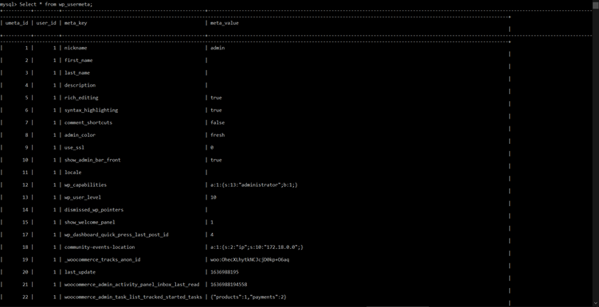

## Find out where is your sensitive data stored[mySQL]? 

In this step, we will try to discover the sensitive data stored in the mySQL server.Docker commands will be executed to do so.

1. Open up a new terminal here in Katacoda

2. Access the mySQL server

`docker exec -it mysql /bin/bash`{{execute}}

3. Log in as default root user account

`mysql -r -p12345`{{execute}}

4. Switch to WordPress database

`use wordpress;`{{execute}}

--------------------------------

Example 1. Find out the user data in in the 'wp_users' table

`select * from wp_users;`{{execute}}

As we can see, sensitive data like:

### • username
### • Passwords (hashed by WordPress, more secre)
### • Email addresses
### • User's url

are stored and can be displayed in this way.

These data are created and stored when we **created a sample customer account** previously.

--------------------------------

Example 2. Find out the user data in in the 'wp_usermeta' table

`select * from wp_usermeta;`{{execute}}

As we can see, sensitive data like:

### • First name, last name
### • Telephone number
### • Email addresses
### • Billing and Shipping addresses 

are stored and can be displayed in this way.

These data are created and stored when we:

**• created a sample customer account** 

**• filling in the billing and shipping addresses in checkout/'user' section**

--------------------------------

Example 3. Find out the user data in in the 'wp_comments' table

`select * from wp_comments;`{{execute}}

As we can see, sensitive data like:

### • First name, last name
### • IP addresses
### • Email addresses
### • User url
### • Client device and browser info.

are stored and can be displayed in this way.

These data are created and stored when we:

**• Give a review to a product** 

**• Leave a comment for a post**